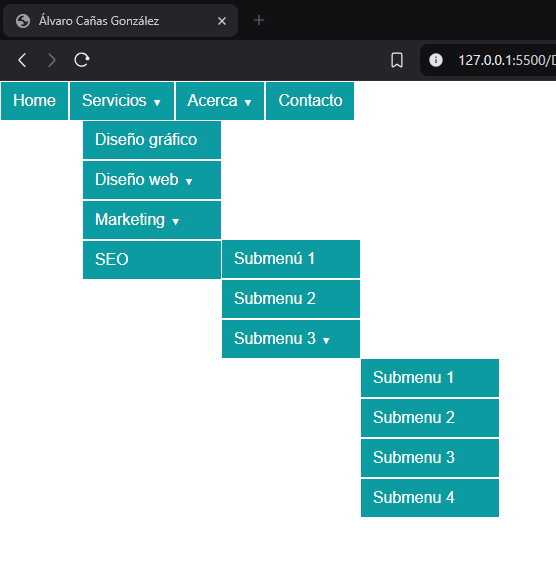

# Práctica 8
### Menú multinivel

En este repositorio se muestra como se realiza un menú multinivel como el mostrado en la siguiente imagen:


Para realizar el siguiente menú multinivel, he utilzado el siguiente código HTML:

```html
<!DOCTYPE html>
<html lang="es">
<head>
    <meta charset="UTF-8">
    <meta name="viewport" content="width=device-width, initial-scale=1.0">
    <link rel="stylesheet" href="style/style.css">
    <title>Álvaro Cañas González</title>
</head>
<body>
    <header>
        <nav class="menu"> <!-- Menú multinivel -->
            <ul> <!-- Primer nivel -->
                <li><a href="#">Home</a></li>
                <li><a href="#">Servicios<span class="flecha">&#9660</span></a>
                    <ul> <!-- Segundo nivel -->
                        <li><a href="#">Diseño gráfico</a>
                            <ul></ul>
                        </li>
                        <li><a href="#">Diseño web<span class="flecha">&#9660</span></a>
                            <ul></ul>
                        </li>
                        <li><a href="#">Marketing<span class="flecha">&#9660</span></a>
                            <ul> <!-- Tercer nivel -->
                                <li><a href="#">Submenú 1</a></li>
                                <li><a href="#">Submenu 2</a></li>
                                <li><a href="#">Submenu 3<span class="flecha">&#9660</span></a>
                                    <ul> <!-- Cuarto nivel -->
                                        <li><a href="#">Submenu 1</a></li>
                                        <li><a href="#">Submenu 2</a></li>
                                        <li><a href="#">Submenu 3</a></li>
                                        <li><a href="#">Submenu 4</a></li>
                                    </ul>
                                </li>
                            </ul>
                        </li>
                        <li><a href="#">SEO</a></li>
                    </ul>
                </li>
                <li><a href="#">Acerca<span class="flecha">&#9660</span></a>
                    <ul></ul>
                </li>
                <li><a href="#">Contacto</a></li>
            </ul>
        </nav>
    </header>
</body>
</html>
```

Como podemos ver en el código HTML, se utiliza las etiquetas &lt;header&gt;, &lt;nav&gt;, &lt;ul&gt; y &lt;li&gt; para crear el menú multinivel, en la etiqueta &lt;header&gt; se crea el menú ya que este forma parté de la cabecera de la página web, en esta insertamos la etiqueta &lt;nav&gt; que contendra el menú con submenús, formando así el multinivel mediante concatenación de listas desordenadas.
Mediante la etiqueta &lt;span&gt; insertamos la flecha con estilos en línea en los elementos multinivel.

Para darle formato se ha utilizado el siguiente estilo en css:

```css
/* Formato genérico de toda la página */
* {
    font-family: sans-serif;
    margin: 0;
    padding: 0;
    color: #fff;
    text-decoration: none;
}

/* Agrupamos el menu de forma horizontal y los submenús se mantendrán de forma vertical. */
.menu > ul > li {
    float: left;
}

/* Le damos formato al menú completo, color de fondo, color de fuente, etc. */
ul li {
    background-color: #0c9ba0;
    color: #fff;
    display: block;
    border: 1px solid;
    padding: 10px 12px;
    top: 10px;
}

/* Agrupamos el menú para que no se muestren los submenús. */
.menu li ul {
    display: none;
    position: absolute;
    min-width: 140px;
}

/* Mostramos los submenus al pasar el ratón por encima. */
.menu li:hover > ul {
    display: block;
}

/* Mostramos el subnivel 2 a la derecha del subnivel 1 */
.menu ul li ul li {
    position: relative;
}

.menu ul li ul li ul {
    right: -140px;
    top: 10;
}

/* le damos formato a la flecha. */
.menu li .flecha {
    font-size: 9px;
    padding-left: 6px;
}
```

Mediante el estilo, modificamos el diseño del menú multinivel para que cuando pasemos el ratón por encima podamos desplegar las secciones que cuenten con otro nivel de menú.

El resultado final es el siguiente:



El código esta disponible en el [repositorio](https://github.com/MameHub/DIW/tree/main/practica_8).